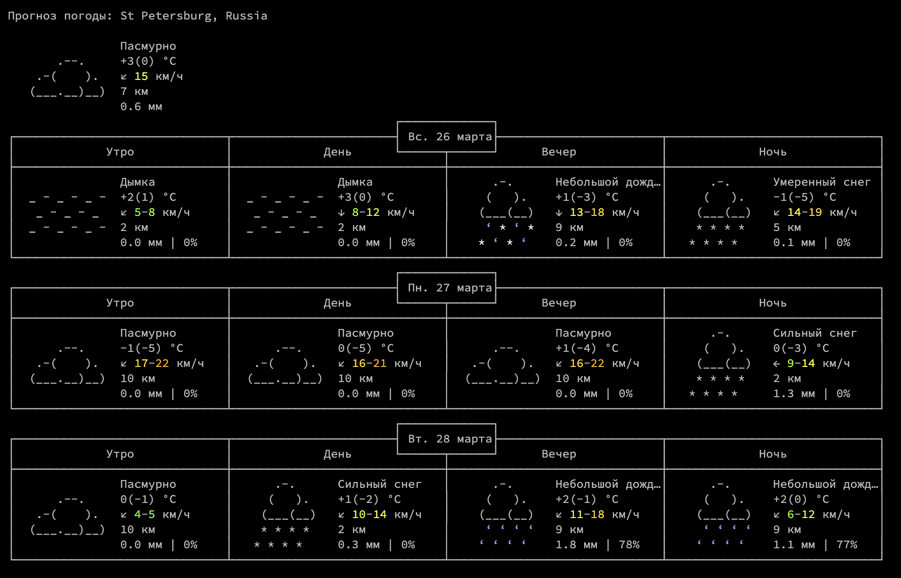

# weather-cli-widget

## Описание

Консольное приложение, отображающие прогноз погоды для выбранного списка городов.

Позволяет настраивать список городов, период времени для прогноза, частоту обновления данных. При этом данные автоматически обновляются с течением времени и виджет перерисовывается. 

Виджет представляется в наглядном цветном формате.

Проект написан на C++, в нем используется API от Open-Meteo и Api-Ninjas. 
Для красивого вывода информации в консоль используются ANSI escape codes. 

С помощью нажатия клавиш можно изменять период времени для прогноза, а также переключаться между городами.

Список городов, частота обновления, количество дней прогноза определены в конфиге (json)

## Источники данных

- [Open-Meteo](https://open-meteo.com/en/docs#latitude=59.94&longitude=30.31&hourly=temperature_2m&forecast_days=16) для прогноза
- [Api-Ninjas](https://api-ninjas.com/api/city) для определения координат по названию города

В качестве библиотеки для HTTP-запросов используется [C++ Requests](https://github.com/libcpr/cpr)

## Отображение

